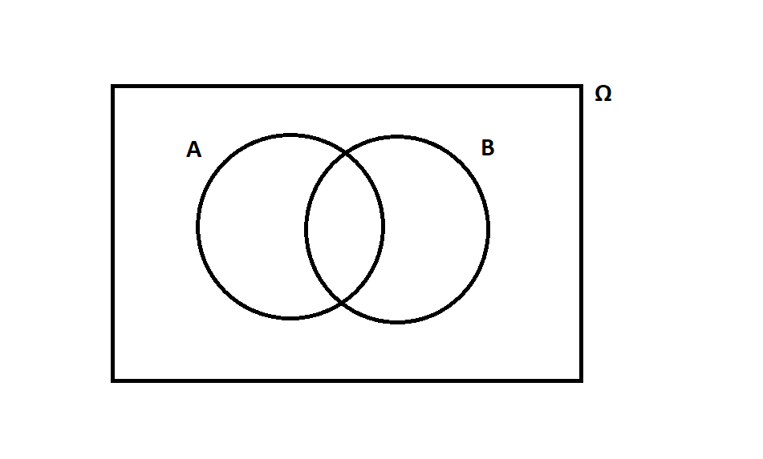
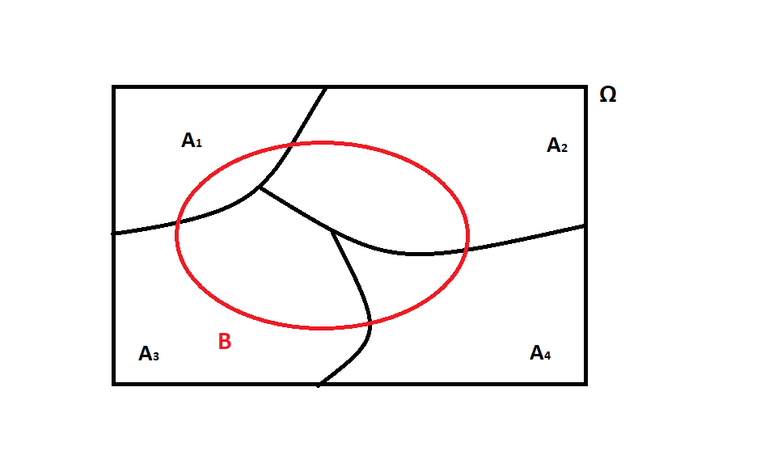

\section{Foundations of Probability}

\subsection{Random Process}

Definition:

\vspace{3cm}

Example:

\vspace{3cm}

Note:

\vspace{3cm}

\subsection{Sample Space}

Definition:

\vspace{3cm}

Example:

\vspace{3cm}
\pagebreak

\subsection{Event}

Definition:

\vspace{3cm}

Example:

\vspace{3cm}

\subsection{Mutually Exclusive or Disjoint Events}

Definition:

\vspace{5cm}

Example:

\vspace{3cm}

\pagebreak

\subsection{Defining Probability}

\vspace{6cm}


\subsection{Axioms of Probability}

\begin{enumerate}
\item The probability of any event is between zero and one:

$0 \leq P(A) \leq 1$

\item The probabilities must add up to 1. 

$P(\Omega) = 1$

\item The probability of mutually exclusive events is additive. 

$$\bigcup\limits_{i=1}^{\infty} A_{i} = \Sigma_{i =1}^\infty P(A_i)$$


\end{enumerate}

__Addition Rule__

\vspace{3cm}

__Law of Complementary Events__

\pagebreak
\section{Representing Events Using Set Notation}

\subsection{Notation}

\begin{table}[H]
\centering
\begin{tabular}{|l|l|l|}
\hline
\textbf{Description} & \textbf{How it is read} & \textbf{How it is written} \\ \hline
Union of Sets        & in A or in B            & $A \cup B$                 \\ \hline
Intersection of Sets & in A and in B           & $A \cap B$                 \\ \hline
\end{tabular}
\end{table}

\subsection{Venn Diagrams}

__Union__

```{r out.width="70%", echo = FALSE, fig.align='center'}


```

__Intersection__

```{r out.width="70%", echo = FALSE, fig.align='center'}


```

\pagebreak
__Complement__

```{r out.width="70%", echo = FALSE, fig.align='center'}


```

__Exercise__
Please shade the following:

$(A \cup B^c)^c$

```{r out.width="70%", echo = FALSE, fig.align='center'}


```


__Exercise__

Draw a Venn diagram of two disjoint events

\pagebreak


\pagebreak
\section{Conditional Probability}

The General Social Survey (GSS) is sociological survey that has been regularly conducted since 1972. It is a  comprehensive survey that provides information on experiences of residents of the United States. The contingency table below is built off two questions on the survey. The first question asks the respondent's race and the second question asks \textit{"Are there any sitations you can imagine in which you would approve of a policeman striking an adult male citizen?}. The answers to this question is displayed as the `polhitok` variable. 

\begin{table}[H]
\centering
\begin{tabular}{|l|l|l|l|l|}
\hline
\multirow{2}{*}{polhitok} & \multicolumn{4}{c|}{race}              \\ \cline{2-5} 
                          & White & Black & Other & \textbf{Total} \\ \hline
Yes                       & 23,260 & 2,359  & 1,010  & 26,629          \\ \hline
No                        & 6,969  & 2,405  & 1,133  & 10,507          \\ \hline
\textbf{Total}            & 30,229 & 4,764  & 2,143  & 37,137          \\ \hline
\end{tabular}
\end{table}
\begin{enumerate}

\item What is the probability that a randomly selected person in this sample is White?

\vspace{3cm}

\item What is the probability that a randomly selected person in this sample is white and approves police strike?

\vspace{3cm}

\item What is the probability that a randomly selected person in this sample approves of police strike given that they are White?

\vspace{3cm}

\end{enumerate}

\pagebreak

\subsection{Definitions}

__Marginal Probability__

\vspace{3cm}

__Joint Probability__

\vspace{3cm}

__Conditional Probability__

\vspace{4cm}

__Indepedence__

\vspace{3cm}

__Multiplication Rule for Independent Processes__

\pagebreak

\section{Law of Total Probability}
```{r out.width="100%", echo = FALSE, fig.align='center'}


```

\vspace{3cm}

\section{Bayes' Rule for Events}

\pagebreak

__Exercise__

An algorithm is written to detect cat images. When given a cat image the algorithm identifies the image as a cat image 80% of the time. However, when given an image without a cat the algorithm falsely identifies it as a cat image 50% of the time. The algorithm is to be tested with a set of images of which are 7% cat images. What is the probability that an image is a cat image if the algorithm identifies it as a cat image? 

