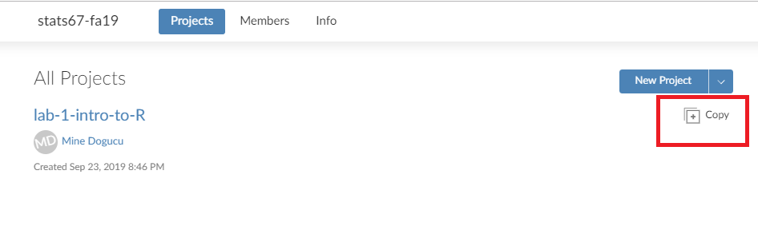

layout: true
  
<div class="my-header"></div>

<div class="my-footer"> 
 Copyright &copy; <a href="https://mdogucu.ics.uci.edu">Dr. Mine Dogucu</a>. All Rights Reserved.</div> 

---

## Our Tool Box 

- Canvas (which you have already used for reading questions)
- Piazza
- RStudio Cloud
- Gradescope

---

## Piazza

- Log on to Piazza. 
- If you have used Piazza before show your tips and tricks to anyone else in your group.
- Read the posts that are already there. 

---


## Join RStudio Cloud

We have to make sure everybody completes these steps before we move on

- Join RStudio Cloud via the link provided on the white board.
- On the left banner in the Spaces section click the space for our course stats67-fa19.

---

## Make a copy of today's project

- Whenever you start any project for the first time, make a copy for yourself. Only make a copy the first time you work on a project. You can come back and your project will still be there for you to continue working on it. 

  </img>

- Once you make a copy, it may take time to deploy project. Give it some time. Refresh the page if needed. 

- Once your project has loaded click on the .Rmd file on the lower right panel to open it. If you have completed these steps make sure that those around you have also completed them.


---


# What is R Markdown?

We will have a more sophisticated definition of R Markdown later but for now you can think of it as a file that can have R code and text. 

R code files (i.e. R scprits) have .R extension.  
Markdown files which are text files in essence have .md extension.   
R Markdown files that have both R and md components have .Rmd extension.  

For instance all of this presentation is written in R Markdown because I can write text and R code at the same time such as the one below

---


# What is R Markdown?

For instance all of this presentation is written in R Markdown because I can write text and R code at the same time. This is what R code looks like 

```{r}
print("hello world")
```

---

# Knitting

The way to "run" or "process" a R Markdown document is called _knitting_

Now that you have your .Rmd file open go ahead and Knit your document by 

- Clicking the Knit button or

- Using short cut Ctrl (Cmd on Mac) + Shift + K 

Saving documents - Every time you knit it saves

Note that you have different knit options such as knitting to HTML or pdf. We will use pdf because it is easier to upload to Gradescope.

---

## Demo

Demo on RStudio Cloud

---

## Recap

We have learned that we can insert R code chunk to an R Markdown file by 

- Clicking Insert > R or
- using shortcuts Ctrl+Alt+I (Windows) &	Command+Option+I (Mac)

---


## Your Turn

<iframe width="560" height="315" align ="middle" src="https://www.youtube.com/embed/bLF6sAAMb4s?start=3" frameborder="0" allow="accelerometer; autoplay; encrypted-media; gyroscope; picture-in-picture" allowfullscreen></iframe>

---


## Your Turn

You have been provided with `bechdel` dataframe object in your project. Get to know the dataframe and answer the questions. 

---


## Getting Ready for Submission


- At the top of the .Rmd document you will see a part where my name is written. Replace it with full names of your group members separated by commas. Be careful about the quotation.

- Knit your document as a .pdf one last time. 

- On the files panel, in the lower right, you should see your pdf file. Check the pdf file. Click on More > Export > Download. You now have downloaded your pdf file to your computer.


---

## Submission

- Log onto Gradescope and upload it. 

- Gradescope may ask you which page has which questions, provide this information.
