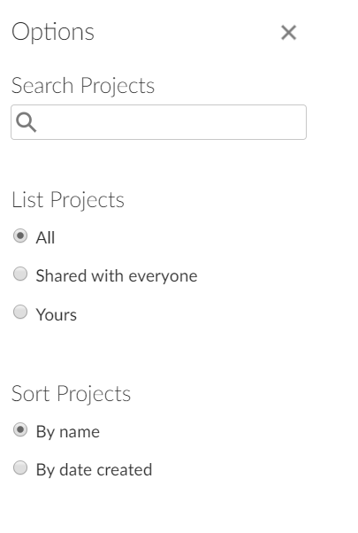

layout: true
  
<div class="my-header"></div>

<div class="my-footer"> 
 Copyright &copy; <a href="https://mdogucu.ics.uci.edu">Dr. Mine Dogucu</a>. All Rights Reserved.</div> 

---

```{r message = FALSE, echo = FALSE}
library(tidyverse)
library(titanic)
```

## Check

- Font size

## Announcements

- Additional office hours: Thursdays 3 - 4 pm.

- [OpenIntro has videos](https://www.youtube.com/user/OpenIntroOrg/playlists)
- Do not trust Canvas for your grades. Grading policies are on the course website. 

- Even though I respect your preferred name, Gradescope can only detect your official name that is on the Course roster. 

---

## Clarifications

- Reading questions are due BEFORE class. You only get ONE attempt and it is timed. 
- Week 1 was for getting used to the course. Make sure you read instructions.
- Lab assignments are to be completed in class during discussion sessions.

---
## Clarifications

- Reading Question  regarding music study skills

---

## Attendance

If you do not attend lecture or discussion, you will be lost. 

This is NOT a class that you can only show up to midterm and final, and pass.

---
## All About You Survey

- Thank you. I am happy to get to know you.
- Concerns: Programming, Integrals, 
---
## RStudio Cloud

  </img>
---
## Why R?

- First and foremost you will add one more language to your skill set. You should know both Python and R.
- Unlike Python, which is a general purpose language, R was built for data handling and analysis and is a powerful tool for data science. 
- R is rich and provides functions for any typical statistical model that you can think of.
- R provides a comprehensive data visualization tools that are easy to use such as `ggplot`.

---

## Review - Study Design

Patients with a certain disease at a state hospital participate in a research study. They are randomly split into two and either receive a new found drug or a place based on their group. Researchers observe that the patients who have taken the drug have been cured from the disease. Which of the following is true? 

a) Researchers can conclude that this drug cures the disease.  
b) This is an observational study since it says "observe". Researchers cannot conclude that this drug cures the disease.   
c) Researchers can conclude that this drug cures the disease only for this sample. 

---
## Review - Study Design

Patients with a certain disease at a state hospital participate in a research study. They are randomly split into two and either receive a new found drug or a place based on their group. Researchers observe that the patients who have taken the drug have been cured from the disease. Which of the following is true? 

a) Researchers can conclude that this drug cures the disease.  
b) This is an observational study since it says "observe". Researchers cannot conclude that this drug cures the disease.   
__c) Researchers can conclude that this drug cures the disease only for this sample.__ 

---
## A/B testing

- A/B testing is basically an experiment that compares two versions (A and B) of a single variable.
- It is commonly used on measuring online activies such as click-through rates (usually online ads) and revenue per user.
- Example: Let's assume that on your company's web page you show the ads on the right side. You want to test whether moving the ad to the header will increase clicks on the ad (and money for your company). For randomly selected half of the users, you can display ads on the right (version A - control), and for the other half you can display the ads on the header (version B - treatment) and compare. 

---
## Review - Types of Variables

```{r}
titanic_train %>% 
  select(PassengerId, Name) %>% 
  glimpse()
  
```

Note that both `PassengerId` and `Name` are nomimal variables. There is really no meaningful ordering or grouping for these variables. 
---
## Review - Study Design
Mohammed claims that he can tell the difference between tap water and bottled water. His friend, Phoebe does not believe him. They want to test his claim. They invite their friend Xuan to help out. Xuan pours bottled or tap water into a cup and gives it to Phoebe who then gives this to Mohammed. They repeat this twenty times. The study design is

a. a confounding design.  
b. a single-blind design.  
c. a double-blind design.  
---

## Review - Relationships of Variables

If two variables are related/associated they are called __dependent__ variables (e.g. having a college degree and income)

If two variables are not related/associated they are called __independent__ variables (e.g. your hair color and whether it will rain in Gaborone.)
---
## Some R terminology 

```{r}
glimpse(titanic_train)
```
---
## Some R terminology

R is a functional language. In this case `glimpse()` is a function and `titanic_train` is the argument. 

---
## Review - __%>%__ (aka pipe operator)

Since R is functional let's remember functions from algebra. If you want to execute fog(x), you have three choices in R

```{r eval = FALSE}
f(g(x))
```


```{r eval = FALSE}
g(x) %>% 
  f()
```

```{r eval = FALSE}
x %>% 
  g() %>% 
  f()
```

---
## Review - __%>%__ (aka pipe operator)


```{r eval = FALSE}
glimpse(titanic_train)
```

```{r eval = FALSE}
titanic_train %>% 
  glimpse()
```

---

## Review - __%>%__ (aka pipe operator)

```{r}
count(titanic_train, Survived)
```

```{r}
titanic_train %>% 
  count(Survived)
```

---

## Review - `count()`

Count can take more than two variables.

```{r}
count(titanic_train, Survived, Pclass)
```

---
## Review - Multiple Lines

You can break code over multiple lines

```{r}
count(titanic_train, 
      Survived, 
      Pclass)
```
---
## Summarizing Sleep Data by Hand

```{r echo = FALSE, warning = FALSE, message = FALSE}
you_sleep <- read_csv("data/you-sleep.csv")
you_sleep$sleep


```

```{r eval = FALSE, echo = FALSE}
sleep <- c(7,8,8,8,8,7,8,4,7,7.5)
you_sleep <- tibble(sleep = sleep)
you_sleep %>% 
  summarize(mean(sleep), median(sleep),
            quantile(sleep, 0.25), 
            quantile(sleep, 0.75),
            var(sleep),
            sd(sleep))

you_sleep %>% 
  ggplot(aes(x = "", y = "sleep")) +
  geom_boxplot()
```

Calculate 1)mean, 2) median, 3) mode, 4) variance, 5)standard deviation, 5) first quartile, 6) third quartile, 7) interquartile range and 

Draw a boxplot
---
## Summarizing Data


```{r}
titanic_train %>% 
  summarize(mean(Fare), median(Fare),
            sd(Fare), var(Fare), 
            min (Fare), max(Fare))
```
---
## Summarizing Data - Quantiles 

```{r}
titanic_train %>% 
  summarize(median(Fare),
            quantile(Fare, 0.50))
```
---

## Summarizing Data - Quantiles 

```{r}
titanic_train %>% 
  summarize(q1 = quantile(Fare, 0.25),
            q3 = quantile(Fare, 0.75))
```
---

## Summarizing Data - `group_by()`

```{r}
titanic_train %>% 
  group_by(Pclass) %>% 
  summarize(mean_fare = mean(Fare))
```

You can only group by a categorical variable.
Imagine doing this by hand. You would first take the `Fare` amounts and then divide them into three groups based on `Pclass` and then calculate the mean for each group. 
---

## Mean (1 or 3) and Std Dev (1 or 3)

```{r echo = FALSE, warning = FALSE, message = FALSE, fig.align='center'}
set.seed(12345)
mean3_sd1 <- rnorm(1000, 3, 1)
mean1_sd3 <- rnorm(1000, 1, 3)
mean1_sd1 <- rnorm(1000, 1, 1)
mean3_sd3 <- rnorm(1000, 3, 3)

response <- c(mean3_sd1, 
                  mean1_sd3, 
                  mean1_sd1, 
                  mean3_sd3)

plot_type <- c(rep("A",1000),
               rep("B",1000),
               rep("C",1000),
               rep("D",1000))


mean_sd <- tibble(response = response,
                  plot_type = plot_type)

mean_sd %>% 
  ggplot(aes (x = response)) +
  geom_histogram() +
  facet_wrap(.~plot_type) +
  labs(x = "", title = "") +
  theme(text = element_text(size=30))


```

---

## Descriptives Notation

| Description        	| Population Parameter 	| Sample Statistic 	|
|--------------------	|----------------------	|------------------	|
| Mean               	|         $\mu$       	|     $\bar{x}$    	|
| Variance           	|      $\sigma^2$      	|       $s^2$      	|
| Standard Deviation 	|       $\sigma$       	|        $s$       	|


---

## Effect of Outliers

Let's assume that the height in our classroom has bell-shaped symmetric distribution. In such distributions, mean = median = mode. 

If Michael Jordan (6 feet 6 inches - 198.12 cm) were to walk into our classroom. How would the distibritution of our heights change? Describe the shape and spread. Order the mean, median, and mode in descending order.

If Tyrion Lannister (4 feet 5 inches - 135.00 cm) were to walk into our classroom. How would the distibritution of our heights change? Describe the shape and spread. Order the mean, median, and mode in descending order.


---
## Plots, plots, and more plots

- for a single categorical variable
- for a pair of categorical variables
- for a single continuous variable
- for a pair of continuous variables
- for a single categorical and continuous variables


---

## Within One Week

* Due Wednesday:  
  + Reading and Reading Questions 
* Due Friday:  
 + HW  (Introduction to Data) 
 Note that your new homework will be posted on this      Friday. Make sure to check the course website.
* Due Monday:   
  + Reading and Reading Questions 
 
  


