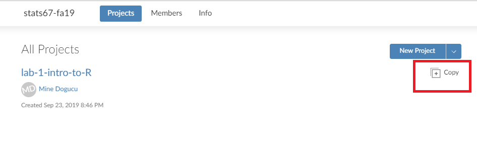

layout: true
  
<div class="my-header"></div>

<div class="my-footer"> 
 Copyright &copy; <a href="https://mdogucu.ics.uci.edu">Dr. Mine Dogucu</a>. All Rights Reserved.</div> 

---

```{r setup, include=FALSE}
knitr::opts_chunk$set(echo = FALSE)
```

```{r message = FALSE}
library(titanic)
library(tidyverse)
library(fivethirtyeight)

titanic_train <- 
  titanic_train %>% 
  mutate(Survived = case_when(Survived == 0 ~ "Not Survived",
                              Survived == 1 ~ "Survived")) %>% 
  mutate(Pclass = as.factor(Pclass))
```

## Recap 

- Always make a copy of today's project, whenever you start the project for the first time. 

  </img>

---

## Recap


You can "run" or "process" .Rmd file by knitting. To knit your document  

- Clicking the Knit button or

- Using short cut Ctrl (Cmd on Mac) + Shift + K 

Every time you knit your .Rmd file is automatically saved.

---
## Recap


We have learned that we can insert R code chunk to an R Markdown file by 

- Clicking Insert > R or
- using shortcuts Ctrl+Alt+I (Windows) &	Command+Option+I (Mac)


---
## One More Short Cut 

For %>% (aka piper operator) you can use the shortcut Ctrl + Shift + M (Windows) or Cmd + Shift + M (Mac)

When you read out your code, you can read %>% as "and then"


---

## Today

Data Visualization using ggplot2 package.

## Examples

[BBC](https://bbc.github.io/rcookbook/)  
[FiveThirtyEight](https://fivethirtyeight.com/features/the-rise-of-religiously-inspired-terrorism-in-france/)  
[Master List](http://r-statistics.co/Top50-Ggplot2-Visualizations-MasterList-R-Code.html#Histogram)  

---


## Three steps of basic visualization with ggplot2 package

1. Make some space (this soon will make sense) using the `ggplot()` function.

2. Draw your axes using `aes()` function.

3. Add you plot, whether it is  histogram, bar plot or something else. We will call these geom objects.


---

## Flow for the Day

For every plot, 

1) Decide, what variables to use.  
2) Decide which variable is on which axes.  
3) Decide what kind of plot it is.  
4) Watch the demo for plotting.  
---
<br>
<br>
<br>
```{r fig.align = "center", fig.height=6}
titanic_train %>% 
  ggplot(aes(x = Survived)) + 
  geom_bar() +
  theme(text = element_text(size=30)) 

```


???
Make sure to do this step by step please

Show that titanic %>% ggplot() makes space. 
titanic %>% ggplot(aes(x = Survived)) puts the axes.
and so on.

Note that they will only see + in R code while using ggplot function because the visualization works in layers and we are adding layers by +.


---
```{r fig.align = "center", fig.height=6}
titanic_train %>% 
  ggplot(aes(x = Fare)) + 
  geom_histogram() +
  theme(text = element_text(size=30))
```

Why are we getting this warning? 

???

They should know what bins are from reading. Remind them. ggplot will set up a default binwidth but it ill also warn you about it. 
Make sure to set your own bindwidth. Remind them we had 3 steps of plots 1)
making space 2) axes 3) geom object. Which of these steps is bindwidth related to?
---

```{r fig.align = "center", fig.height=6}
titanic_train %>% 
  ggplot(aes(x = Fare)) + 
  geom_histogram(binwidth = 15) +
  theme(text = element_text(size=30))
```
  
What step of the code is binwidth related to?
  
???    

Since binwidth is related to the geom object we can put the binwidth argument inside the geom_histogram function. 
---

## Cheatsheet

Look at the ggplot cheatsheet. Moving on you will attempt at making the plot by finding the geom object from your cheatsheet.
---
<br>
<br>
<br>
```{r fig.align = "center", fig.height=6}
titanic_train %>% 
  ggplot(aes(x = Pclass, y = Fare)) +
  geom_boxplot() +
  theme(text = element_text(size=30))
```

---
## You Attempt This First

Make a plot that shows the relationship between age of the passenger and the fare that they paid. Comment whether older passengers bought more expensive tickets.

---

```{r fig.height=6, fig.align='center'}
titanic_train %>% 
  ggplot(aes(x = Age, y = Fare )) +
  geom_point() +
  theme(text = element_text(size=30))
```


---
## Color 

```{r echo = TRUE, eval = FALSE}
titanic_train %>% 
  ggplot(aes(x = Fare )) + 
  geom_histogram(color = "salmon") 
```

```{r fig.height = 5}
titanic_train %>% 
  ggplot(aes(x = Fare )) + 
  geom_histogram(color = "salmon") +
  theme(text = element_text(size=30))
```


---

## Fill 

```{r echo = TRUE, eval = FALSE}
titanic_train %>% 
  ggplot(aes(x = Fare)) + 
  geom_histogram(fill = "salmon") 
```

```{r fig.height=5}
titanic_train %>% 
  ggplot(aes(x = Fare)) + 
  geom_histogram(fill = "salmon") +
  theme(text = element_text(size=30))
```

---

## Shape

```{r fig.height = 4, fig.align='center', warning = FALSE, eval = FALSE, echo = TRUE}
titanic_train %>% 
  ggplot(aes(x = Age, y = Fare )) +
  geom_point(shape = 4) 
```

```{r fig.height = 4, fig.align='center', warning = FALSE}
titanic_train %>% 
  ggplot(aes(x = Age, y = Fare )) +
  geom_point(shape = 4) +
  theme(text = element_text(size=30))
```
---

class: center, inverse
## More colors

<br>
<br>
<br>

[bit.ly/colors-r](bit.ly/colors-r)

---


class: center, inverse
## More shapes

<br>
<br>
<br>

[bit.ly/shapes-r](bit.ly/shapes-r)

---

## Stacked bar plot

Can you guess where the fill argument will go for this stacked bar plot?

```{r fig.height=5, fig.align='center'}
titanic_train %>% 
  ggplot(aes(x = Pclass, fill = Survived)) +
  geom_bar() +
  theme(text = element_text(size=30))
```

???

Note that since it is a barplot y axis is reserved for count
Note that these are the default color scheme of ggplot
They should focus on adding a second variable rather than changing colors.


---

## Your Turn

Make this plot with any color other than the default one and submit it. Make sure to set binwidth. `bechdel` is loaded already.

```{r warning = FALSE, fig.height=4, fig.align='center'}
bechdel %>% 
  ggplot(aes(x = domgross, fill = binary)) +
  geom_histogram(binwidth = 10000000) +
  theme(text = element_text(size=30))
```

---

## Getting Ready for Submission

At the top of the .Rmd document you will see a part where my name is written. Replace it with full names of your group members separated by commas. Be careful about the quotation.

Knit your document as a .pdf one last time. 

On the files panel, in the lower right, you should see your pdf file. Check the pdf file. Click on More > Export > Download. You now have downloaded your pdf file to your computer.


---
## Submission

- Log onto Gradescope and upload it. 

- Gradescope may ask you which page has which questions, provide this information.

- Make sure to add your group members' names 

