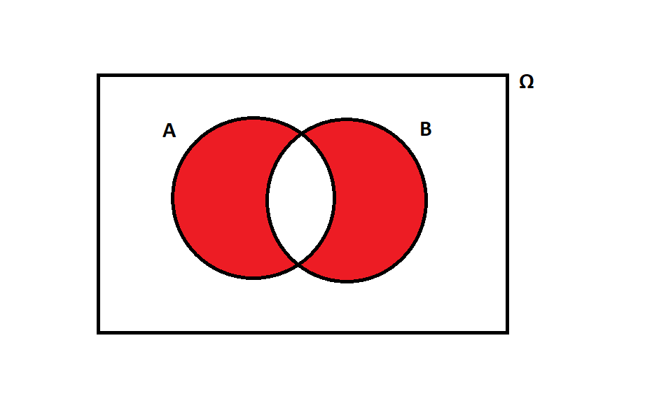

layout: true
  
<div class="my-header"></div>

<div class="my-footer"> 
 Copyright &copy; <a href="https://mdogucu.ics.uci.edu">Dr. Mine Dogucu</a>. All Rights Reserved.</div> 

---

```{r echo = FALSE, message = FALSE}
library(tidyverse)
library(titanic)
```


## Announcements

- Reading questions have been graded
---
## Review

Which of the following are mutually exclusive events. Select multiple

a) A - There is rain &  B - There is sunshine  
b) A - Today is Sunday & B - Today is Saturday  
c) A - You pass your statistics class & B - You fail your statistics class 
d) A - A person's first name starts with the letter J - B A person's last name starts with the letter J  
e) A - A person speak Spanish - B - A person speaks English  

---
## Review

Which of the following are mutually exclusive events. Select multiple

a) A - There is rain &  B - There is sunshine  
b) __A - Today is Sunday & B - Today is Saturday__  
c) __A - You pass your statistics class & B - You fail your statistics class__   
d) A - A person's first name starts with the letter J - B A person's last name starts with the letter J  
e) A - A person speak Spanish - B - A person speaks English  

---
## Review

```{r out.height=200, echo = FALSE, fig.align='center'}

```

Which of the following represents the shaded area in the Venn diagram?

a) $(A \cup B)^c$  
b) $(A \cap B)^c$  
c) $(A^c\cup B)^c$  
d) $(A^c \cap B) \cup (A \cap B^c)$


---
## Review

```{r out.height=200, echo = FALSE, fig.align='center'}

```

Which of the following represents the shaded area in the Venn diagram?

a) $(A \cup B)^c$  
b) $(A \cap B)^c$  
c) $(A^c\cup B)^c$  
__d)__ $(A^c \cap B) \cup (A \cap B^c)$
---

## Review
.pull-left[
```{r echo = FALSE, out.height= 250, fig.align ='center' }
titanic_train %>% 
  mutate (Embarked = as.factor(Embarked)) %>% 
  filter(Embarked != "") %>% 
  mutate(Embarked = case_when (Embarked == "C" ~ "Cherbourg",
                               Embarked == "Q" ~ "Queenstown",
                               Embarked == "S" ~ "Southampton")) %>% 
  ggplot(aes(x = Embarked, y = Fare)) +
  geom_boxplot() +
  theme(text = element_text(size=25)) 
  
```
]

.pull-right[Which of the following statements is __false__?  ]

a. Fares of Queenstown passengers had the lowest median.

b. Southampton passengers had the highest number of outliers in Fares when passengers are compared to other passengers from their embarkation point

c. The third quartile of Fares of Cherbourg passengers is higher than the maximum Fare of Southampton passengers. 


---

## Review
.pull-left[
```{r echo = FALSE, out.height= 250, fig.align ='center' }
titanic_train %>% 
  mutate (Embarked = as.factor(Embarked)) %>% 
  filter(Embarked != "") %>% 
  mutate(Embarked = case_when (Embarked == "C" ~ "Cherbourg",
                               Embarked == "Q" ~ "Queenstown",
                               Embarked == "S" ~ "Southampton")) %>% 
  ggplot(aes(x = Embarked, y = Fare)) +
  geom_boxplot() +
  theme(text = element_text(size=25)) 
  
```
]

.pull-right[Which of the following statements is __false__?  ]

a. Fares of Queenstown passengers had the lowest median.

b. Southampton passengers had the highest number of outliers in Fares when passengers are compared to other passengers from their embarkation point

c. __The third quartile of Fares of Cherbourg passengers is higher than the maximum Fare of Southampton passengers.__ 
---

## Random Variable
Random variables are numeric values that are possible numeric outcomes of a random process. Capital letters $X, Y, Z$ are usually used to indicate random variables. 

Lower case letters $x, y, z$ are reserved to indicate __observed outcome__ of the random variables. 

e.g. $X$ is the number on a die after a roll.   
The possible outcomes of $X$ are $x \in \{1,2,3,4,5,6\}$  
To indicate a specific outcome we use subscript such as $x_1$, $x_2$... or we 
use $x_i$ to refer to any outcome.  
$P(X = 1) = \frac{1}{6}$

---
## Discrete Random Variables

A discrete random variable has a sample space that is finite or countably infinite. 

e.g. Let X be the random variable that represents the number of heads in a single coin flip.

$x \in \{0, 1\}$ where 0 indicates the outcome was tails and 1 indicates heads. Since the sample space is finite, X is a discrete random variable. 

---
## Discrete Random Variables

More examples

Let $X$ be the number of heads in 5 coin flips. $\Omega_x = \{0,1,2,3,4,5\}$. The sample space is finite.

Let $X$ be the proportion of correct responses on a test with 100 questions. $\Omega_x = \{0.00,0.01,0.02,...,0.98, 0.99, 1.00\}$. The sample space is finite. Note that the elements of the sample space is not integers.

Let $X$ be the number of times you roll a die until you get a 6. $\Omega_x = \{1,2,3,4,5,6,7,8,...\}$ The sample space is countably infinite.

---

## Probability mass function (pmf)
X is the number on a die after a roll
```{r echo = FALSE, fig.align = 'center', fig.height=6 }

ggplot(data = data.frame(x = 1:6,
                         y = rep(1/6, 6),
                         yend = rep(0, 6)),
       aes(x = x, y = y, xend = x, yend = yend)) +
  geom_point() +
  geom_segment() +
  scale_x_continuous(breaks=1:6,
                     limits = c(0.8, 6.5)) +
  scale_y_continuous(limits = c(0.0,0.3)) +
  labs(x = "x",
       y = "p(x)") +
  theme_bw() +
  theme(text = element_text(size = 20)) 
```

---

## Cumulative distribution function (cdf)

```{r echo = FALSE}

ggplot(data = data.frame(x = 1:6,
                         y = rep(1:6)/6,
                         xend = c(2:6,6)),
       aes(x = x, y = y, xend = xend, yend = y)) +
  geom_point() +
  geom_segment() +
  scale_x_continuous(breaks=1:6,
                     limits = c(0.8, 6.5)) +
  scale_y_continuous(limits = c(0.0,1.1)) +
  labs(x = "x",
       y = "")+
  theme_bw() +
  theme(text = element_text(size = 20)) 
```
---
## Cumulative distribution function

Using the cdf calculate these:

$P(X<2) =$   
$P(X\leq2) =$   
$P(X\leq6) =$   
$P(X>2) =$   
---

## Cumulative distribution function

Using the cdf calculate these:

$P(X<2) = \frac{1}{6}$   
$P(X\leq2) = \frac{2}{6}$   
$P(X\leq6) = 1$   
$P(X>2) = 1 - \frac{2}{6} = \frac{4}{6}$   
---
## Expected Value

You are playing an amazing game where you always win. Host of the game makes you draw a banknote from a bag that has exactly four banknotes, `$1`, `$5`, `$10`, and `$50`. What is the expected value of earning in this game? 

---
## Expected Value

You are playing an amazing game where you always win. Host of the game makes you draw a banknote from a bag that has exactly four banknotes, `$1`, `$5`, `$10`, and `$50`. What is the expected value of earning in this game?

Before learning probability: 

$\frac{1+5+10+50}{4} = 16.5$

After learning probability: 
$1\cdot \frac{1}{4}+ 5\cdot \frac{1}{4} +10\cdot \frac{1}{4} + 50\cdot \frac{1}{4} = 16.5$
---
## Expected Value

You are playing an amazing game where you always win. Host of the game makes you draw a banknote from a bag that has exactly five, `$1`, `$5`, `$10`, and 2 of `$50`. What is the expected value of earning in this game? 
---
## Expected Value

You are playing an amazing game where you always win. Host of the game makes you draw a banknote from a bag that has exactly five, `$1`, `$5`, `$10`, and 2 of `$50`. What is the expected value of earning in this game?

Before learning probability: 

$\frac{1+5+10+50+50}{5} = 23.2$

After learning probability: 
$1\cdot \frac{1}{5}+ 5\cdot \frac{1}{5} +10\cdot \frac{1}{5} + 50\cdot \frac{2}{5} = 23.2$

---

## Expected Value

You are playing an amazing game where you always win. Host of the game makes you draw a banknote from a bag that has exactly four banknotes, `$2`, `$10`, `$20`, and `$100`. The amounts on the banknotes are exactly the double of what we have seen in the first scenario. What is the expected value of earning in this game?

After learning probability: 
$2\cdot \frac{1}{4}+ 10\cdot \frac{1}{4} +20\cdot \frac{1}{4} + 100\cdot \frac{1}{4}$ or even better
$2\times[1\cdot \frac{1}{4}+ 5\cdot \frac{1}{4} +10\cdot \frac{1}{4} + 50\cdot \frac{1}{4}] = 2\times[16.5]$

---
## Expected Value of Discrete Random Variables
Expectation of random variable $X$ with a pmf of $p(x)$ is  
$E[X] = \displaystyle \sum_{x} x p(x) = \mu$

The expect value of linear combination of random variables $X$ and $Y$ and fixed numbers $a$ and $b$ is 

$E[aX+bY] = aE[X] + bE[Y]$

---
## Variance of Discrete Random Variables

$Var(X) = E[(X-\mu)^2] = E[X^2] - E[X]^2$

Can you explain variance in words?

$Var(aX+bY) = a^2Var(x)+b^2Var(Y)$
---
## Mean (1 or 3) and Std Dev (1 or 3)

```{r echo = FALSE, warning = FALSE, message = FALSE, fig.align='center'}
set.seed(12345)
mean3_sd1 <- rnorm(1000, 3, 1)
mean1_sd3 <- rnorm(1000, 1, 3)
mean1_sd1 <- rnorm(1000, 1, 1)
mean3_sd3 <- rnorm(1000, 3, 3)
response <- c(mean3_sd1, 
                  mean1_sd3, 
                  mean1_sd1, 
                  mean3_sd3)
plot_type <- c(rep("A",1000),
               rep("B",1000),
               rep("C",1000),
               rep("D",1000))
mean_sd <- tibble(response = response,
                  plot_type = plot_type)
mean_sd %>% 
  ggplot(aes (x = response)) +
  geom_histogram() +
  facet_wrap(.~plot_type) +
  labs(x = "", title = "") +
  theme(text = element_text(size=30))
```

---

## Descriptives Notation

| Description        	| Population Parameter 	| Sample Statistic 	|
|--------------------	|----------------------	|------------------	|
| Mean               	|         $\mu$       	|     $\bar{x}$    	|
| Variance           	|      $\sigma^2$      	|       $s^2$      	|
| Standard Deviation 	|       $\sigma$       	|        $s$       	|


---

## Mean and Variance with  R

For observed data we have already seen the summarize function which can be used to calculate mean, variance, and standard deviation.

```{r}
titanic_train %>% 
  summarize(mean(Fare), sd(Fare), 
            var(Fare))
```

We will learn about how we can calculate $\mu$ and $\sigma^2$ for a given probability function.

---
## R as a calculator

```{r}
3 + 5
```

Note that output is a vector with a length of 1. R is one indexed. 
---

## Object Assignment in R

```{r}
x <- 13
x
```
---

## Object Assignment in R

```{r}
y <- c(21, 8)
y
```

Note the [1] in the output the index number for 21
---

## Object Assignment in R

```{r}
test <- c("yes", "no", "no", "no")
test
```

---

## Object Assignment in R

Why is it the `<-` operator and not `=`?

Read more about it [here](https://stackoverflow.com/questions/1741820/what-are-the-differences-between-and-assignment-operators-in-r) after class.

---


## Unfair Die

An unfair die has been created with the following properties:

```{r}
x <- c(1, 2, 3, 4, 5, 6)
f_x <- c(1/10, 1/10, 1/10, 2/10, 
         2/10, 3/10)
```

Is `f_x` a probability distribution? How do you know?

---
## Expected Value by hand

How would you calculate $E(X)$ if you were calculating by hand? You do not need to calculate it but think about the process.
---
## Expected Value in R

```{r}
mu <- sum(x*f_x)
mu
```
---

## Variance by hand

How would you calculate $Var(X)$ if you were calculating by hand? You do not need to calculate it but think about the process.
---
## Variance in R

```{r}
sigma2 <- sum((x-mu)^2*f_x)
sigma2 
```
---

## Standard Deviation in R

```{r}
sigma <- sqrt(sigma2)
sigma
```


 

