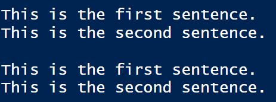

layout: true
  
<div class="my-header"></div>

<div class="my-footer"> 
 Copyright &copy; <a href="https://mdogucu.ics.uci.edu">Dr. Mine Dogucu</a>. All Rights Reserved.</div> 

---
```{r message = FALSE, echo = FALSE}
library(openintro)
library(tidyverse)
library(titanic)
```


## Announcements

- Note that you already have a homework due on 10/25. You will not be assigned a homework on 10/25 that would normally be due 11/01. Instead you will be provided midterm review questions. These questions will not be graded. You are encouraged to study in groups. 

---

## FAQ - Line Break in Rmd

This is the first sentence.
This is the second sentence.

This is the first sentence.  
This is the second sentence. 

  </img>

Even though these two paragraphs look similar in their .Rmd backend, there is a slight difference. The second paragraph has a line break. At the end of the first sentence, you can hit the space bar twice before hitting enter to make a line break.

---
## Review - Sampling

- A good sample is __representative__ of the population. 
- In simple random sampling every element of the sample has an equal chance of being selected.
- There are other sampling methods that help us get _representative_ samples. 
---
## Review - Sample Statistics

For some samples we have looked at some statistics. For instance we have looked at mean differences of domestic gross of movies that passed the Bechdel test and those that did not. 

We looked at independence of gun ownership and being born in this country based on General Social Survey. 

Note that so far we only talked about samples. We will learn how to make __inference__ about the population after the midterm.
---
## Review - Data Visualization

```{r}
glimpse(cats)
```

The `cats` data frame has two variables of interest `Bwt` and `Hwt` which are Birth weight and Heart Weight of cats respectively. 

If we wanted to examine the relationship between `Bwt` and `Hwt` what `geom_object()` could we utilize? In other words, what kind of plot could we make? 
---

## Review - Data Visualization

```{r fig.align = 'center', fig.height = 5, eval = FALSE}
cats %>% 
  ggplot(aes(x = Bwt, y = Hwt)) +
  geom_point() +
  theme(text = element_text(size=30))

  
```

```{r echo = FALSE, fig.align = 'center', fig.height = 5}
cats %>% 
  ggplot(aes(x = Bwt, y = Hwt)) +
  geom_point() +
  theme(text = element_text(size=30))

  
```

---
## Review - Data Visualization

```{r echo = FALSE, fig.align = 'center', fig.height = 5}
titanic_train %>% 
  ggplot(aes(x = Pclass)) +
  geom_bar() +
  theme(text = element_text(size=30))

  
```

This is a histogram of class of passengers on Titanic. True or False?

---
## Review - Data Visualization

```{r echo = FALSE, fig.align = 'center', fig.height = 5}
titanic_train %>% 
  ggplot(aes(x = Pclass)) +
  geom_bar() +
  theme(text = element_text(size=30))

```

False! It is a bar plot. Categorical variables are best represented by bar plots. Even though class labels may look 1, 2, 3 numeric they are categories. 

---
## Review - Data Visualization

For single categorical variable: bar plot  
For two categorical variables: stacked bar plots  
For single numeric variable: histogram, dot plot, box plot  
For two numeric variables: scatter plot  
For a categorical variable and a numeric variable: side-by-side box plot

There are many other ways to visualize data. Your `ggplot` cheat sheets have many other `geom_objects()`

---

## Review - pmf and cdf

__pmf__: $f_X(x) = P(X = x)$

__cdf__: $F_X(x) = P(X \leq x)$

---
## Review - pmf and cdf

Let $X$ be a random variable with a probability mass function $f(x)$ and cumulative distribution function $F(x)$. Fill in the blanks in the table.

| x      	| 1    	| 2    	| 3    	| 4 	|
|--------	|------	|------	|------	|---	|
| $f(x)$ 	| 0.23 	| ?    	| 0.15 	| ? 	|
| $F(x)$ 	| ?    	| 0.36 	| ?    	| ? 	|

---
## Review - pmf and cdf

| x      	| 1    	| 2    	| 3    	| 4    	|
|--------	|------	|------	|------	|------	|
| $f(x)$ 	| 0.23 	| 0.13 	| 0.15 	| 0.49 	|
| $F(x)$ 	| 0.23 	| 0.36 	| 0.51 	| 1    	|

---
## Numeric Variables in R

```{r}
age <- 21
typeof(age)
str(age)
```
---
## Numeric Variables in R
```{r}

temp <- 72.25
typeof(temp)
str(temp)
```
---
## Numeric Variables in R

```{r}
age2 <- 21L
typeof(age2)
str(age2)
```

---

## Categorical Variables in R

```{r}
outcome <- c("heads", "tails", "tails", 
             "tails", "heads")

str(outcome)

outcome <- factor(outcome)

str(outcome)
```

Characters signify that the values are nonnumeric. 
Factor signifies that it is a categorical vector and also shows that there are two categories(levels).
---

## Categorical Variables in R

```{r}
response <- c("Extremely Disagree", 
              "Disagree",
              "Agree", 
              "Extremely Agree")

response <- factor(response, 
                   order = TRUE)

str(response)
```


---

## Categorical Variables in R

Let's fix the ordering

```{r}


response <- 
  factor(response, 
         order = TRUE,
         levels = c("Extremely Disagree",
                    "Disagree",
                    "Agree",
                    "Extremely Agree"))

str(response)
```
---
## FAQ - When do we use factor()?

Data does not always come in perfect shape for us ready to use for our analysis. Consider the variables in the `titanic` dataset. Can you spot some that have wrong types?

```{r}
glimpse(titanic_train)
```
---
## FAQ - When do we use factor()?

```{r fig.height=5, fig.align='center', eval = FALSE}
titanic_train %>% 
  ggplot(aes(x = Pclass)) +
  geom_bar() 

```

```{r fig.height=5, fig.align='center', echo = FALSE}
titanic_train %>% 
  ggplot(aes(x = Pclass)) +
  geom_bar() +
  theme(text = element_text(size=30))

```


Even though `Pclass` is defined as an integer, we could still use `geom_bar()`.
---
## FAQ - When do we use factor()?

```{r fig.height=3, eval = FALSE}
titanic_train %>% 
  ggplot(aes(x = Pclass, y = Fare)) +
  geom_boxplot() 

```

```{r fig.height=3, echo = FALSE}
titanic_train %>% 
  ggplot(aes(x = Pclass, y = Fare)) +
  geom_boxplot() +
  theme(text = element_text(size=30))

```

What is wrong with this plot?

---
## FAQ - When do we use factor()?

```{r fig.height=3, eval = FALSE}
titanic_train %>% 
  ggplot(aes(x = factor(Pclass), 
             y = Fare)) +
  geom_boxplot() 

```

```{r fig.height=3, echo = FALSE}
titanic_train %>% 
  ggplot(aes(x = factor(Pclass), 
             y = Fare)) +
  geom_boxplot() +
  theme(text = element_text(size=30))

```
---

## A different solution

```{r fig.height=3, eval = FALSE}
titanic_train %>% 
  mutate(Pclass = as.factor(Pclass)) %>% 
  ggplot(aes(x = Pclass, 
             y = Fare)) +
  geom_boxplot() 

```

```{r fig.height=3, echo = FALSE}
titanic_train %>% 
  mutate(Pclass = as.factor(Pclass)) %>% 
  ggplot(aes(x = Pclass, 
             y = Fare)) +
  geom_boxplot() +
  theme(text = element_text(size=30))

```

---
## `mutate()`

We use mutate to create new variables or over-write the old ones. 

Why do you think the following code still shows `Pclass` as an integer even though we mutated it to be a factor? 

```{r}
glimpse(titanic_train)
```


---
## `mutate()`

```{r}
titanic_train <- titanic_train %>% 
  mutate(Pclass = as.factor(Pclass))

glimpse(titanic_train)
```

---

## Review - Binomial vs. Geometric

__Binomial__ The probability of $k$ successes in $n$ trials.

$\Omega_k = \{0, 1, 2, 3, ... n\}$

__Geometric__ The probability that the success will be in the $n$th trial for the first time.

$\Omega_n = \{1, 2, 3, 4, ...\}$


---
## Review - Binomial vs. Geometric

|     	| Binomial   	| Geometric 	|
|-----	|------------	|-----------	|
| pmf 	| `dbinom()` 	| `dgeom()` 	|
| cdf 	| `pbinom()` 	| `pgeom()` 	|


---

## Review

It is estimated that 45.3% of emails we receive are spam [(Statista)](https://www.statista.com/statistics/420400/spam-email-traffic-share-annual/). Mohsen has received 30 emails today. 

1) How many of these emails would you expect to be spam? Call this value $\mu$.

2) If Mohsen was to receive 30 emails every day would you expect $\mu$ many spam email every time? Is there variance? Calculate. 

3) Pause and think. Of the 30 emails he received, what is the probability that 29 are spam? 

4) What is the probability that the number of spam emails he received is less than 9?

---
## Review

1) How many of these emails would you expect to be spam? Call this value $\mu$.

$E(X) = n p = 30 \times 0.453 = 13.59$

```{r}
n <- 30
p <- 0.453

mu <- n*p
mu
```

---
## Review

2) If Mohsen was to receive 30 emails every day would you expect $\mu$ many spam email every time? Is there variance? Calculate. 

No. The expected value represents an average number of spam emails (successes) if we were to repeat the random process (receiving 30 emails) many times. 

$Var(X) = n  p  (1-p) = 30 \times 0.453 \times (1-0.453) = 7.43373$

```{r}
sigma2 <- n*p*(1-p)
sigma2
```
---
## Review
3) Pause and think. Of the 30 emails he received, what is the probability that 29 are spam? 

$P(k = 29) = {30 \choose 29}(0.453)^{29} (1-0.453)^1$

```{r}
dbinom(x = 29, size = 30, prob = 0.453)
```

```{r}
dbinom(x = 29, size = n, prob = p)
```

---
## Review

4) What is the probability that the number of spam emails he received is less than 9?

$P(k<9) = P(k\leq8)$ so this is a cdf question.

$= P(k =0) + P(k=1) +.... P(k=7) +P(k=8)$

```{r}
pbinom(q = 8, size = 30, prob = 0.453)
```

```{r}
pbinom(q = 8, size = n, prob = p)
```
---
## Discrete Uniform Distribution

In discrete uniform distribution, all values are equally likely to be observed. A fair roll die follows a uniform distribution. 

$X\sim unif(a,b)$

pmf: $P(X=x) = \frac{1}{n}$

$\Omega_X = \{a, a+1, ..., b-1, b\}$

---
## Discrete Uniform Distribution

A broken phone alarm starts ringing once every day randomly. Let X be the random variable representing the hour on the 24 hour system when the alarm goes on. 

Then $\Omega_X = \{0, 1, 2, ...,22,23\}$

$X\sim unif(0,23)$

The probability that the alarm goes sometime between 15:00 - 16:00.

$P(X = 15) = \frac{1}{24} = 0.04167$

---
## Discrete Uniform Distribution


Note that the R function `dunif()` is used to calculate probability density function of continuous uniform distributions and __not__ for probability mass function of discrete uniform distributions. 


---
## Discrete Uniform Distribution

R is an open-source language. That means any body can contribute to R. 

Luckily someone wanted to contribute with a discrete uniform probability mass function.

However, this function is not installed when R is installed.


---
## R packages

When we download R or open RStdudio cloud, we have R functions that we can use such as `dbinom()`. These already installed set of functions are part of __base R__.

The rest comes from the open source community who develop functions, datasets and provide it for the public use in R packages. 

For instance the `ddunif()` function comes from the `fitur` package. 

---
## Using R packages

In order to use a package, you first have to make sure it is downloaded. 

```{r eval = FALSE}
install.packages("fitur")
```

You only do installation process once. Once it is downloaded it will always be downloaded to your computer (RStudio Cloud is slightly different).

---
## Using R packages

Once a package is downloaded you can use any function or object provided within the package. In order to use the `ddunif()` function from `fitur` package we have two options. 

Option 1:
```{r message = FALSE}
library(fitur)
ddunif(x = 15, min = 0, max = 23)
```

Use this option if you are going to keep using functions from the same package over and over again. `library(fitur)` and all packages you load should be at the top of your code.
---
## Using R packages

Option 2:
```{r}
fitur::ddunif(x = 15, min = 0, max = 23)
```

Use this option if you are going to use functions from this package only few times. Also, this is a good option if you are unfamiliar with a package and you want to remind yourself which package the function belongs to. 
---
## Poisson Distribution

$X \sim Poisson (\lambda)$

pmf:

$P(k) = \frac{\lambda^k}{k!} e^{-\lambda}$ where $k$ is number of observed events. 

Note: The number of events in a __fixed__ time or space. 

$\Omega_x = \{0,1,2....\}$

$E(X) = Var(X) = \lambda$

---
## Poisson Distribution

At an emergency clinic, 12 patients arrive on average per hour. What is the probability that 8 patients will arrive in the next hour?

$P(k = 8) = \frac{12^8}{8!}e^{-12}=$
```{r}
12^8/factorial(8)*exp(-12)
```

```{r}
dpois(x = 8, lambda = 12)
```


---
## Poisson Distribution

What is the probability that 20 patients will arrive in the next hour?

$P(X = 20)$

```{r}
dpois(x = 20, lambda = 12)
```
---
## Poisson Distribution

What is the probability that less than 20 patients will arrive in the next hour?

$P(X < 20) = P(X \leq 19)$

```{r}
ppois(q = 19, lambda =12)
```

